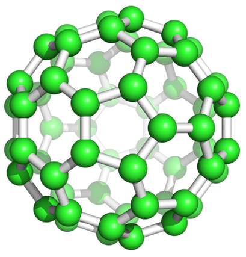

# kroto
Klustering R0uter T0pology

Harry Kroto, was an English chemist. 
He discovered and named the buckminsterfullerene, which looks a bit like a routing topology!

## Overview
The kroto library provides a thin wrapper around the JGroups framework. 

kroto was designed to provide clustered JVM applications an API to dynamically find live service endpoints.
 
There are five core entities in kroto:

| Component  | Description |
| ---------- | ----------- |
| Selector   | Given a key, return a live endpoint. Selector is a thin wrapper around a Group and a Topology. |
| ReplicaSet | A mapping of key to ReplicaSetId. A replica set is a logical grouping of like endpoints.|
| Mapper     | Employs a algorithms to access keys in a ReplicaSet. Available strategies are "mod", "ring" and "map". |
| LoadBalancer| A function that given a list of endpoints, selects a single endpoint based on a user provided algorithm. |
| Topology | A Topology connects a Mapper and a LoadBalancer to provide a Selector the ability given a key, to return a "live" endpoint in a cluster. |

## Example

