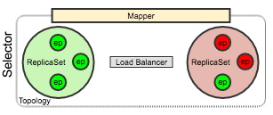

# kroto (WIP / Work In Progress)
Klustered R0uting T0pology

Harry Kroto, was an English chemist. 
He discovered and named the buckminsterfullerene, which looks a bit like a network topology!


## Overview
The kroto library provides a thin wrapper around the [JGroups reliable messaging toolkit. ](http://www.jgroups.org/)

kroto was designed to provide clustered JVM applications an API to dynamically find live service endpoints given a routing key.
Endpoints are grouped in ReplicaSets which make up a Topology.
The Topology is accessed by the application via a Selector when given a key, selects a ReplicaSet that returns a live endpoint via a LoadBalancer. kroto provides more then just cluster membership, it provides pluggable partitioning which allows a node to receive a requests, and forward it to a node that can provide a response based on data locality.


 
There are five core entities in kroto:

| Component  | Description |
| ---------- | ----------- |
| Selector   | Given a key, return a live endpoint. Selector is a thin wrapper around a Group and a Topology. |
| ReplicaSets| A virtual entity that is a mapping of a key to ReplicaSetId which in turn is a logical grouping of endpoints.|
| Mapper     | Employ an algorithm to access keys in ReplicaSets. Available strategies are "mod", "ring" and "map". |
| LoadBalancer| A function that given a list of endpoints, selects a single endpoint based on a user provided algorithm. |
| Topology | A Topology connects a Mapper and a LoadBalancer to provide a Selector the ability given a key, to return a "live" endpoint in a cluster. |

## Example

Running  the clustered telnet example.
In this example we will start 4 telnet servers. 
There will be two replica sets with two servers each. 
Servers running on ports 8000 and 8001 will be part of replica set r8000.
Servers running on ports 9000 and 9001 will be part of replica set r9000.

In a terminal:
sbt assembly

cd main/bin

Start the 1st telnet server:

```bash
./main.sh \
-group=test \
-uri="tcp://localhost:8000?node=localhost:8000&node=localhost:8001&node=localhost:9000&node=localhost:9001" \
-service=http://localhost:8080 \
-telnetPort=8800 \
-replicaSets=r8000,r9000  
```
Start the 2nd telnet server

```bash
./main.sh \
-group=test \
-uri="tcp://localhost:8000?node=localhost:8000&node=localhost:8001&node=localhost:9000&node=localhost:9001" \
-service=http://localhost:8081 \
-telnetPort=8801 \
-replicaSets=r8000,r9000  
```

Start the 3rd telnet server

```bash
./main.sh \
-group=test \
-uri="tcp://localhost:9000?node=localhost:8000&node=localhost:8001&node=localhost:9000&node=localhost:9001" \
-service=http://localhost:9080 \
-telnetPort=9800 \
-replicaSets=r9000,r8000 
```

Start the 4th telnet server

```bash
./main.sh \
-group=test \
-uri="tcp://localhost:9001?node=localhost:8000&node=localhost:8001&node=localhost:9000&node=localhost:9001" \
-service=http://localhost:9081 \
-telnetPort=9801 \
-replicaSets=r9000,r8000 
```

Open up a shell and type:
```bash
$telnet 0 8800

Trying 0.0.0.0...
Connected to 0.
Escape character is '^]'.
    _...._
  .'   \ _'.
 /##\__/##\_\      __             __     
|\##/  \##/  |    / /__ _______  / /____ 
|/  \__/  \ _|   /  '_// __/ _ \/ __/ _ \
 \ _/##\__/#/   /_/\_\/_/  \___/\__/\___/
  '.\##/__.'          selector topology test app
    `""""`
kroto shell
Usage: kroto> [help] [leader] [top] [map <k=v>] [select <key>]
  select <key>  show the selected endpoint for key
  map <k=v k=v> sets the key mapping for the the topology
  top           show the kroto routing topology
  leader        show the cluster leader (denoted by *)
  help          show help
kroto>

```

Open up another shell and type:
```bash
$telnet 0 9800

Trying 0.0.0.0...
Connected to 0.
Escape character is '^]'.
    _...._
  .'   \ _'.
 /##\__/##\_\      __             __     
|\##/  \##/  |    / /__ _______  / /____ 
|/  \__/  \ _|   /  '_// __/ _ \/ __/ _ \
 \ _/##\__/#/   /_/\_\/_/  \___/\__/\___/
  '.\##/__.'          selector topology test app
    `""""`
kroto shell
Usage: kroto> [help] [leader] [top] [map <k=v>] [select <key>]
  select <key>  show the selected endpoint for key
  map <k=v k=v> sets the key mapping for the the topology
  top           show the kroto routing topology
  leader        show the cluster leader (denoted by *)
  help          show help
kroto>

```

### Leader
Lets issue the `leader` command in the first telnet session:
```bash
kroto> leader
cluster leader: LogicalAddress(blackbook-2-61587)*
kroto> 
```

Now the second telnet session:
```bash
kroto> leader
cluster leader: LogicalAddress(blackbook-2-61587)
kroto> 
```
Notice how the first session is connected to the leader, and the second is not.


### Topology
Lets take a look at the topology by entering `top` in the first shell:
```bash
kroto> top
topology:
replicaSetId: r9000
	address: blackbook-2-34336
	endpoint: http://localhost:9080
	address: blackbook-2-905
	endpoint: http://localhost:9081
replicaSetId: r8000
	address: blackbook-2-61587
	endpoint: http://localhost:8080
	address: blackbook-2-20649
	endpoint: http://localhost:8081
replicas: 
	
kroto> 
```
Lets take a look at the topology in the second shell:
```bash
kroto> top
topology:
replicaSetId: r9000
	address: blackbook-2-34336
	endpoint: http://localhost:9080
	address: blackbook-2-905
	endpoint: http://localhost:9081
replicaSetId: r8000
	address: blackbook-2-20649
	endpoint: http://localhost:8081
	address: blackbook-2-61587
	endpoint: http://localhost:8080
replicas: 
	
kroto> 

```

You can see that there are tow replica sets in our topology; r9000 and r8000.

Both sets have two nodes that can be load balanced against.

We can not test `select`, as we do not have a map installed yet. (Our example uses Mapper.map for routing.)
So lets add a map!

In either shell we will issue the `map key0=r8000 key1=r8000 key2=r8000 key3=r9000 key4=r9000` command:

```bash
kroto> map key0=r8000 key1=r8000 key2=r8000 key3=r9000 key4=r9000
new mapping:
key4 -> ReplicaSetId(r9000)
key0 -> ReplicaSetId(r8000)
key1 -> ReplicaSetId(r8000)
key2 -> ReplicaSetId(r8000)
key3 -> ReplicaSetId(r9000)
kroto> 
```

Now, lets go to our other shell and look at the topology again:

```bash
kroto> top
topology:
replicaSetId: r9000
	address: blackbook-2-34336
	endpoint: http://localhost:9080
	address: blackbook-2-905
	endpoint: http://localhost:9081
replicaSetId: r8000
	address: blackbook-2-20649
	endpoint: http://localhost:8081
	address: blackbook-2-61587
	endpoint: http://localhost:8080
replicas: 
	1444980918 -> ReplicaSetId(r8000)
	-1529434546 -> ReplicaSetId(r8000)
	-723591347 -> ReplicaSetId(r9000)
	922975623 -> ReplicaSetId(r8000)
	-870323528 -> ReplicaSetId(r9000)
kroto> 
```

You can see that our 5 mappings have been replicated to the other nodes in the topology! (The keys are hashed.)

### Select
Now lets select some keys and see where we get routed:
```bash
kroto> select key2
endpoint: http://localhost:8080
replica:  r8000

kroto> select key2
endpoint: http://localhost:8081
replica:  r8000

kroto> select key3
endpoint: http://localhost:9081
replica:  r9000

kroto> select key3
endpoint: http://localhost:9080
replica:  r9000
kroto> 
```

Lets kill our node that represents http://localhost:8081, (go to the shell and kill the process.)

Lets issue a top command:
```bash
kroto> top
topology:
replicaSetId: r9000
	address: blackbook-2-34336
	endpoint: http://localhost:9080
	address: blackbook-2-905
	endpoint: http://localhost:9081
replicaSetId: r8000
	address: blackbook-2-61587
	endpoint: http://localhost:8080
replicas: 
	1444980918 -> ReplicaSetId(r8000)
	-1529434546 -> ReplicaSetId(r8000)
	-723591347 -> ReplicaSetId(r9000)
	922975623 -> ReplicaSetId(r8000)
	-870323528 -> ReplicaSetId(r9000)
kroto>
```

Notice how replicaSet r8000 is down 1 node (http://localhost:8081)

Lets try `select` again:
```bash
kroto> select key2
endpoint: http://localhost:8080
replica:  r8000

kroto> select key2
endpoint: http://localhost:8080
replica:  r8000
kroto> 
```
You can see that once the node is removed from the replica set, it can no longer be selected.

## Code Examples

